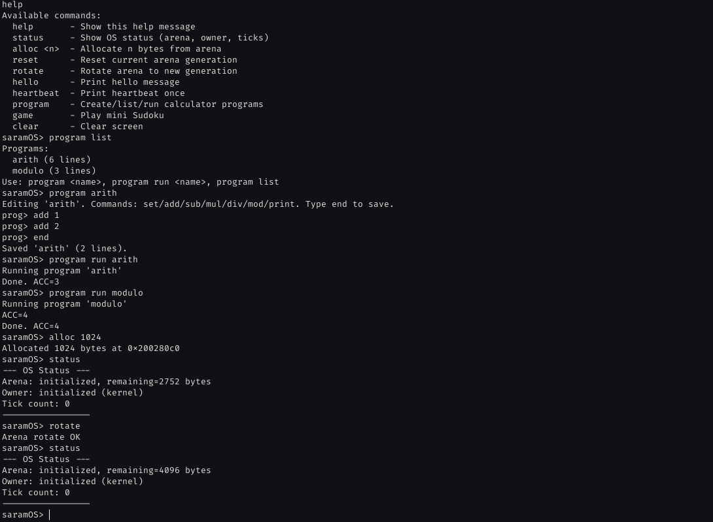

# saramOS



**saramOS**는 STM32F769I-DISCO (Cortex-M7, DISC1 호환)를 기본 타겟으로 하며 DISC1도 지원하는 POSIX-free 베어메탈 런타임/RTOS 프로젝트입니다. 현재는 작은 resilient RTOS kernel core를 포함하며, TCB 단위 libttak owner context, generation-bound arena, PendSV context switching, HardFault 기반 task eviction 경로를 제공합니다.

---

## 목차

1. [하드웨어 요구사항](#하드웨어-요구사항)
2. [소프트웨어 요구사항](#소프트웨어-요구사항)
3. [프로젝트 구조](#프로젝트-구조)
4. [빌드 방법](#빌드-방법)
5. [플래싱 방법](#플래싱-방법)
6. [Resilient RTOS Kernel Core](#resilient-rtos-kernel-core)
7. [libttak 통합: Arena & Ownership](#libttak-통합-arena--ownership)
8. [디버깅 및 팁](#디버깅-및-팁)
9. [라이선스](#라이선스)

---

## 하드웨어 요구사항

| 항목 | 사양 |
|------|------|
| 보드 | **STM32F769I-DISCO** (STM32F769NIH6, DISC1 호환) |
| 코어 | ARM Cortex-M7, 216 MHz (현재 예제는 16 MHz HSI로 부팅) |
| 플래시 | 2 MB (0x0800_0000) |
| SRAM | 512 KB (0x2000_0000) |
| 디버거 | 내장 ST-Link/V2 (Micro-USB CN14, DISC1은 ST-Link/V2-1) |
| UART | USART1 PA9(TX) / PA10(RX), 115200-8-N-1 (ST-Link 가상 COM 포트) |

---

## 소프트웨어 요구사항

- **GNU Arm Embedded Toolchain** (`arm-none-eabi-gcc`, `arm-none-eabi-ar`, `arm-none-eabi-objcopy`, `arm-none-eabi-size`)
- **OpenOCD** (플래싱 및 디버깅용)
- **GNU Make**
- (선택) `screen`, `minicom`, `picocom` 등으로 UART 로그 확인

### Ubuntu/Debian 설치 예시

```bash
sudo apt update
sudo apt install gcc-arm-none-eabi binutils-arm-none-eabi openocd make
# UART 모니터링
sudo apt install picocom
picocom -b 115200 /dev/ttyACM0
```

### macOS (Homebrew)

```bash
brew install --cask gcc-arm-embedded
brew install openocd make
```

---

## 프로젝트 구조

```
saramOS/
├── Makefile                  # 최상위 오케스트레이션 (APP_DIR, BOARD 지정)
├── README.md                 # 영문 README
├── README.ko.md              # 이 파일 (한국어)
├── ROADMAP.md                # libttak POSIX-free 리팩토링 로드맵
├── configs/
│   ├── stm32f769i-disco      # 기본 보드 CFLAG/LDFLAG 정의
│   └── stm32f769i-disc1      # DISC1 변형 CFLAG/LDFLAG 정의
├── engine/
│   └── libttak/              # libttak 서브모듈 (베어메탈 브랜치)
│       ├── include/          # 공개 헤더 (ttak/mem/arena_helper.h 등)
│       ├── src/              # 소스 (baremetal_alloc.c, baremetal_pthread.c 등)
│       ├── Makefile          # libttak 단독 빌드
│       └── lib/libttak.a     # 빌드 산출물
├── os/
│   └── default/              # 기본 OS 이미지 (셸, 커널, 네트워크, SD)
│       ├── main.c            # 공통 셸 및 앱 명령 등록
│       ├── builtin_programs.c# 내장 계산기 프로그램
│       ├── syscalls.c        # Newlib stub
│       └── Makefile
├── apps/
│   └── example/
│       └── game/
│           └── sudoku/       # 대표 예시 앱 (기본 APP_DIR)
│               ├── app_sudoku.c
│               ├── sudoku.c
│               ├── sudoku.h
│               └── Makefile
├── examples/
│   └── README.md             # 예시는 apps/로 이동함
├── include/
│   ├── hal/
│   │   ├── board.h           # 보드 중립적 HAL 진입점
│   │   ├── stm32f769i-disco.h   # 레지스터 정의 전용 HAL
│   │   └── stm32f769i-disc1.h   # DISC1 변형 HAL
│   └── os/
│       ├── saramos_arena.h   # saramOS arena 래퍼 헤더
│       ├── saramos_kernel.h  # TCB, scheduler, eviction API
│       └── saramos_owner.h   # saramOS owner 래퍼 헤더
├── src/
│   ├── hal/stm32f769i-disco/  # 기본 보드 HAL
│   │   ├── hal_eth.c
│   │   ├── hal_gpio.c
│   │   ├── hal_sdmmc.c
│   │   ├── hal_sys.c
│   │   ├── hal_uart.c
│   │   ├── linker.ld
│   │   └── startup.S
│   ├── hal/stm32f769i-disc1/  # DISC1 변형 HAL
│   │   ├── hal_eth.c
│   │   ├── hal_gpio.c
│   │   ├── hal_sdmmc.c
│   │   ├── hal_sys.c
│   │   ├── hal_uart.c
│   │   ├── linker.ld
│   │   └── startup.S
│   └── os/
│       ├── saramos_arena.c   # libttak arena_helper 래퍼
│       ├── saramos_context.S # PendSV/HardFault Cortex-M7 assembly
│       ├── saramos_kernel.c  # Ready queue, scheduling, forced reclaim
│       └── saramos_owner.c   # libttak owner 래퍼
├── tools/
│   ├── boot/                 # 부트로더 보조 파일 (커스텀 링커 스크립트, 스타트업)
│   ├── fsutils/              # SD 카드 파일시스템 유틸리티 (cat, echo, mkdir, rm, tee)
│   ├── coreutils/            # 최소 Linux 스타일 유틸리티 (cp, mv, ls, grep, sort 등)
│   ├── shell/                # 향상된 Unix 스타일 셸 (환경 변수, glob, for/if/source)
│   ├── vi/                   # vi 에디터 포트 및 saramOS 베어메탈 적응 레이어
│   │   └── saramos_port/     # FatFs / UART에 매핑한 POSIX 형태 stub
│   ├── fs_test_capture.py    # fsutils / shell / vi용 시리얼 테스트 캡처
│   ├── sd_test_capture.py    # SD 카드 디버그용 시리얼 테스트 캡처
│   ├── stm32_flash.sh        # OpenOCD 플래싱 스크립트
│   └── test_board.py         # 시리얼 콘솔 기본 보드 회귀 테스트
└── third_party/
    ├── newlib_posix/
    └── u-boot/
```

---

## 빌드 방법

### 1) 전체 빌드 (libttak + 기본 앱)

프로젝트 루트에서:

```bash
make
```

이 명령은 다음을 순차적으로 수행합니다:

1. `engine/libttak`을 `EMBEDDED_BAREMETAL=1`로 크로스 컴파일 → `libttak.a` 생성
2. 기본 앱(`apps/example/game/sudoku`)을 `os/default` 위에 컴파일/링크
3. `.elf` → `.bin` / `.hex` 변환 (`objcopy`)
4. `arm-none-eabi-size`로 섹션 크기 출력

출력 예시:

```
   text    data     bss     dec     hex filename
  31513     292  174248  206053   324e5 build/stm32f769i-disco/saramos.elf
```

- **text**: 플래시에 기록되는 코드/RO 데이터
- **data**: 초기값이 있는 RW 데이터
- **bss**: 정적 풀 (libttak buddy/pocket/VMA/heap 등 포함)

### 2) 다른 앱 빌드 / 기본 OS만 빌드

RIOT 스타일: `APP_DIR`로 앱 디렉토리를 선택합니다.

```bash
# 앱 없이 기본 OS 이미지만 빌드
make APP_DIR=os/default

# 원하는 앱 디렉토리 빌드
make APP_DIR=apps/example/game/sudoku

# 선택적 도구(fsutils, vi)를 이미지에 포함해 빌드
make TOOLS=fsutils,vi
make APP_DIR=apps/example/game/sudoku TOOLS=fsutils,vi

# 전체 Linux 스타일 셸 메타패키지 활성화
make TOOLS=shell
make APP_DIR=apps/example/game/sudoku TOOLS=shell

# 현재 APP_DIR 빌드 정리
make clean

# 현재 APP_DIR 섹션 크기 확인
make size
```

`TOOLS` 변수는 이미지에 링크할 선택적 구성 요소의 쉼표 구분 목록입니다. `shell`은 `fsutils`, `vi`, `coreutils`, 향상된 셸을 한 번에 포함하는 메타패키지입니다:

- `fsutils` — SD 카드 파일 유틸리티(`sd rm`, `sd mkdir`, `sd echo`, `sd tee`)와 `sd mountfs` 미니 셸을 추가합니다.
- `vi` — `fsutils`가 필요하며, `sd vi <file>` 라인 에디터를 추가합니다.
- `coreutils` — 셸 안에서 사용할 최소 Linux 스타일 파일/텍스트 유틸리티(`cp`, `mv`, `ls`, `grep`, `sort`, `tac`, `nl`, `fold`, `od`, `strings`, `printf`, `paste`, `xargs` 등)를 추가합니다.
- `shell` — 메타패키지; `fsutils`, `vi`, `coreutils`, 향상된 셸(환경 변수, glob, 간단한 제어 흐름)을 모두 포함합니다.

기본적으로는 모든 도구가 비활성화되어 있어 바이너리 크기를 작게 유지합니다.

### 3) 개별 단계 빌드

```bash
# libttak만 다시 빌드
make -C os/default libttak

# 기본 OS 이미지만 빌드 (libttak이 이미 존재할 때)
make -C os/default board

# 기본 앱을 직접 빌드
cd apps/example/game/sudoku
make
```

### 3) 빌드 실패 시 체크리스트

- `arm-none-eabi-gcc --version`이 출력되는지 확인
- `engine/libttak`이 초기화된 서브모듈인지 확인 (`git submodule update --init --recursive`)
- OpenOCD는 플래싱 단계에서만 필요하며, **빌드 자체에는 필요 없음**

---

## 플래싱 방법

### 방법 A: `make flash` (권장)

빌드가 완료된 후:

```bash
make flash
```

이 명령은 `tools/stm32_flash.sh`를 호출하여 OpenOCD로 바이너리를 내려씁니다.

내부 동작:

```bash
openocd -f board/stm32f769i-disco.cfg \
    -c "init" \
    -c "reset init" \
    -c "halt" \
    -c "flash probe 0" \
    -c "flash write_image erase build/stm32f769i-disco/saramos.bin 0x08000000" \
    -c "verify_image build/stm32f769i-disco/saramos.bin 0x08000000" \
    -c "reset halt" \
    -c "reset run" \
    -c "shutdown"
```

> 보드의 **CN14 (USB ST-LINK)** 포트를 PC에 연결해야 합니다.

### 방법 B: 수동 OpenOCD

`make flash`가 동작하지 않거나 다른 바이너리를 내려쓰고 싶을 때:

```bash
# 1) 미널 하나에서 OpenOCD 서버 실행 (선택, 디버깅용)
openocd -f board/stm32f769i-disco.cfg

# 2) 또는 한 줄로 플래싱
cd apps/example/game/sudoku
openocd -f board/stm32f769i-disco.cfg \
    -c "init; reset init; halt; flash probe 0" \
    -c "flash write_image erase build/stm32f769i-disco/saramos.bin 0x08000000" \
    -c "verify_image build/stm32f769i-disco/saramos.bin 0x08000000" \
    -c "reset halt; reset run; shutdown"
```

### 방법 C: ST-Link 유틸리티 (대안)

`st-link` CLI 도구가 설치되어 있다면:

```bash
st-flash --reset write build/stm32f769i-disco/saramos.bin 0x08000000
```

또는 Windows/Mac에서 **STM32CubeProgrammer** GUI를 사용할 수 있습니다.
- Interface: ST-Link
- Address: `0x08000000`
- File: `apps/example/game/sudoku/build/stm32f769i-disco/saramos.bin`

### 방법 D: GDB + OpenOCD (디버깅 플래싱)

```bash
# 터미널 1
openocd -f board/stm32f769i-disco.cfg

# 터미널 2
arm-none-eabi-gdb build/stm32f769i-disco/saramos.elf
(gdb) target extended-remote localhost:3333
(gdb) load          # 플래시에 로드
(gdb) monitor reset halt
(gdb) continue
```

### 플래싱 후 UART 로그 확인

```bash
# Linux
picocom -b 115200 /dev/ttyACM0

# macOS
picocom -b 115200 /dev/tty.usbmodemXXXX

# 또는 screen
screen /dev/ttyACM0 115200
```

정상 부팅 시 출력 예시:

```
=== saramOS on STM32F769I-DISCO ===
Type 'help' for available commands.

saramOS: resilient kernel core init OK
saramOS: arena init OK
saramOS: owner init OK
libttak: async scheduler init OK
example: calculator programs loaded (arith, modulo)
===================================
saramOS> 
```

기본 예시 앱은 `sudoku` 명령을 추가합니다:

```text
sudoku
```

입력 형식은 `row col value`입니다. 예: `1 2 3`. `0`은 셀을 지우고, `r`은 리셋,
`h`는 도움말, `q`는 종료입니다.

셸에는 작은 programmable calculator 모드도 포함되어 있습니다:

```text
program list
program run arith
program run modulo
program mycalc
prog> set 10
prog> add 7
prog> mod 5
prog> print
prog> end
program run mycalc
```

지원 명령은 `set`, `add`, `sub`, `mul`, `div`, `mod`, `print`입니다. 프로그램은 RAM에 저장되며 재부팅하면 초기화됩니다.

### 선택적 도구

`TOOLS=fsutils,vi`로 빌드하면 셸에 다음과 같은 추가 SD 카드 명령이 생깁니다:

```text
sd rm <file>              # 파일이나 디렉토리 삭제
sd mkdir <dir>            # 디렉토리 생성
sd echo [text]...         # 콘솔에 텍스트 출력
sd tee <file> <text>...   # 파일에 텍스트 쓰기
sd mountfs                # 최소 Unix 형태 셸 진입
sd vi <file>              # 최소 vi 포트로 파일 편집
```

`sd mountfs` 안에서는 `ls`, `cd`, `pwd`, `cat`, `rm`, `mkdir`, `echo`, `tee`, `vi`, `exit`를 사용할 수 있습니다.

#### 전체 셸 환경 (`TOOLS=shell`)

`TOOLS=shell`은 `fsutils`, `vi`, `coreutils`, 향상된 셸을 모두 포함하는 메타패키지입니다. `sd mountfs`에 진입하면 다음과 같은 최소 Linux 스타일 환경을 사용할 수 있습니다.

**파일 및 디렉토리 유틸리티**
```text
ls [-l] [path]            # 파일 목록 출력
cp <src> <dst>            # 파일 복사
mv <src> <dst>            # 파일 이동/이름 변경
rm <path>                 # 파일이나 디렉토리 삭제
mkdir <dir>               # 디렉토리 생성
touch <file>              # 파일 생성 또는 갱신
chmod <mode> <file>       # 파일 속성 변경 (FatFs f_chmod)
find [path] [name]        # 일치하는 항목 나열
cd <dir>                  # 작업 디렉토리 변경
pwd                       # 현재 작업 디렉토리 출력
which <name>              # 명령 존재 여부 확인
```

**텍스트 및 정보 유틸리티**
```text
cat <file>                # 파일 내용 출력
head [-n N] <file>        # 처음 N줄
tail [-n N] <file>        # 마지막 N줄
wc [-lwc] <file>          # 줄/단어/문자 수
grep <pattern> <file>     # 간단한 부분 문자열 검색
sort <file>               # 줄 단위 정렬
uniq <file>               # 인접한 중복 줄 제거
diff <file1> <file2>      # 줄 단위 차이
cut -c N <file>           # 문자 추출
cut -d D -f N <file>      # 구분자로 필드 추출
tr <set1> <set2> <file>   # 문자 변환
rev <file>                # 각 줄 뒤집기
```

**셸 및 시스템 유틸리티**
```text
echo [text]...            # 인자 출력
clear                     # 화면 지우기
sleep <seconds>           # N초 대기
seq [first] [last]        # 숫자 시퀀스 출력
yes [text]                # 텍스트 반복 출력
true / false              # 항상 0 / 1 종료
uname [-a]                # 시스템 이름 출력
uptime                    # 부팅 후 경과 시간 출력
date                      # 현재 날짜/시간 스텁 출력
df                        # 디스크 여유 공간 출력
du [path]                 # 디렉토리 크기 출력
env                       # 환경 변수 출력
export VAR=value          # 환경 변수 설정
unset VAR                 # 환경 변수 삭제
```

**셸 기능**
- 환경 변수 및 `$VAR` 확장.
- 간단한 glob: `*`(임의 문자열), `?`(한 문자).
- 제어 흐름: `if test ...; then ...; fi`, `for var in ...; do ...; done`.
- 스크립트 포함: `source <file>`.
- 내장 명령: `cd`, `pwd`, `echo`, `clear`, `exit`, `export`, `unset`, `env`.

**아직 지원하지 않음**: 파이프라인(`|`), 리다이렉션(`>`, `<`, `>>`), 백그라운드 실행(`&`), 인용 문자, 명령 치환(`$()`).

예제 세션:

```text
saramOS> sd mountfs
$ export GREET=hello
$ echo $GREET world
hello world
$ for f in *.txt; do echo file: $f; done
$ if test -f readme.txt; then echo exists; fi
$ exit
```

### 시리얼 테스트 스크립트

UART 콘솔을 통해 일반적인 보드 검사를 자동화하는 Python 스크립트가 있습니다. `pyserial`이 필요합니다:

```bash
pip install pyserial
python3 tools/test_board.py      # 기본 보드 회귀 (help, sd, net, http)
python3 tools/sd_test_capture.py # SD 카드 init/ls/cat 점검
python3 tools/fs_test_capture.py # fsutils / shell / vi 동작 확인
```

---

## Resilient RTOS Kernel Core

커널 코어는 `include/os/saramos_kernel.h`, `src/os/saramos_kernel.c`, `src/os/saramos_context.S`에 있습니다.

구현된 항목:

- `saramos_tcb_t`: stack pointer, state, priority, task ID, `saramos_owner_t *owner_ctx`, `saramos_arena_t *bound_arena`, bound epoch snapshot.
- `saramos_task_init()`: Cortex-M exception stack frame (`R0-R3`, `R12`, `LR`, `PC`, `xPSR`)과 software frame (`R4-R11`)을 초기화.
- `PendSV_Handler`: `R4-R11` 저장/복구, 현재 TCB의 SP 갱신, 다음 TCB 설치, PSP 기반 exception return 수행.
- `saramos_schedule()`: CMSIS 없이 `0xE000ED04`의 `ICSR.PENDSVSET`을 직접 설정.
- `saramos_task_kill_and_reclaim()`: task를 ready queue에서 제거하고 libttak owner context를 destroy한 뒤 bound arena generation을 rotate/reset.
- `HardFault_Handler`: fault stack을 식별해 `saramos_hardfault_dispatch()`로 넘기고, 현재 TCB를 evict한 뒤 다음 ready task로 전환.

현재 한계:

- 예제 shell은 커널 코어를 초기화하고 링크하지만, task를 명시적으로 만들고 `saramos_kernel_start()`를 호출하기 전까지는 boot application으로 계속 실행됩니다.
- context switch는 integer callee-saved register(`R4-R11`)만 저장합니다. FPU task context, MPU region programming, SysTick time slicing, per-task stack guard region은 다음 단계입니다.
- task stack은 kernel-owned memory에 두는 것을 전제로 합니다. task 자신의 arena에서 stack을 할당하면, 같은 stack 위에서 해당 arena를 회수하는 것은 HardFault escape path 밖에서는 안전하지 않습니다.

## libttak 통합: Arena & Ownership

saramOS는 libttak의 베어메탈 이식 버전을 엔진으로 사용합니다.  단순히 링크만 하는 것이 아니라, **saramOS 자체의 메모리/리소스 관리 레이어도 libttak의 arena와 owner 개념을 직접 참조**합니다.

### Arena (Generational Memory Management)

libttak의 `ttak_arena_env_t` / `ttak_arena_generation_t`는 **epoch 기반 세대 할당**을 제공합니다:

- 한 세대(generation) 안에서 빠른 bump-pointer 할당
- 세대 전체를 한 번에 `reset` (in-place 폐기)
- 세대를 `retire`하면 epoch GC가 나중에 안전하게 회수

**saramOS 래퍼**: `saramos_arena_t` (`include/os/saramos_arena.h`, `src/os/saramos_arena.c`)

```c
#include <os/saramos_arena.h>

saramos_arena_t arena;
saramos_arena_init(&arena);

void *buf = saramos_arena_alloc(&arena, 256);   /* 현재 세대에서 256B 할당 */
size_t rem = saramos_arena_remaining(&arena);   /* 남은 공간 확인 */

saramos_arena_reset(&arena);                    /* 현재 세대 전체 재사용 */
saramos_arena_rotate(&arena);                   /* 새 세대 시작, 이전 세대는 GC 에게 양도 */

saramos_arena_destroy(&arena);
```

베어메탈 기본값:
- 세대 크기: 4 KB
- 청크 기본값: 256 B
- `_Thread_local` 제거, 모든 풀은 `.bss` 정적 배열

### Ownership (Resource Isolation)

libttak의 `ttak_owner_t`는 **서브시스템 단위의 리소스 샌드박스**입니다:

- 이름 기반으로 리소스 포인터 등록 (`register_resource`)
- 이름 기반으로 함수 등록 (`register_func`)
- `execute` 호출 시 등록된 리소스를 `ctx`로 전달하며 격리 실행
- `destroy` 시 등록된 모든 리소스와 맵 자동 해제

**saramOS 래퍼**: `saramos_owner_t` (`include/os/saramos_owner.h`, `src/os/saramos_owner.c`)

```c
#include <os/saramos_owner.h>

saramos_owner_t owner;
saramos_owner_init(&owner, "uart_driver");

/* 리소스 등록 */
saramos_owner_register_resource(&owner, "uart_ctx", &uart_instance);

/* 함수 등록 */
saramos_owner_register_func(&owner, "init", my_uart_init_func);

/* 실행: "init" 함수에 "uart_ctx" 리소스를 ctx로 넘겨 실행 */
saramos_owner_execute(&owner, "init", "uart_ctx", NULL);

/* 서브시스템 종료 시 일괄 정리 */
saramos_owner_destroy(&owner);
```

이 구조를 통해 saramOS의 각 드라이버나 태스크는 **자신의 owner**를 가질 수 있고, 메모리 누수 없이 전체 리소스를 한 번에 정리할 수 있습니다.

### 내부 메모리 풀 현황 (Bare-Metal)

| 풀 | 크기 | 용도 |
|----|------|------|
| Buddy pool | 32 KB | 중대형 블록 할당 |
| Pocket pool | 32 KB | 소형 객체 (≤512 B) |
| VMA region | 16 KB | 중간 크기 매핑 |
| Large region | 16 KB | 대형 객체 폴백 |
| Baremetal heap | 64 KB | `baremetal_alloc.c` first-fit 힙 |
| 기타 `.bss` | ~14 KB | 기타 정적 변수/스택 |
| **합계** | **~174 KB** | 512 KB SRAM 내 여유 있음 |

---

## 디버깅 및 팁

### 링커 맵 확인

`apps/example/game/sudoku/build/stm32f769i-disco/saramos.map` 파일을 통해 심볼 주소와 섹션 배치를 확인할 수 있습니다.

### HardFault 발생 시

1. OpenOCD로 접속:
   ```bash
   openocd -f board/stm32f769i-disco.cfg
   ```
2. GDB로 `info registers`, `backtrace` 확인
3. `linker.ld`에서 스택/힙 경계 확인

### UART가 출력되지 않을 때

- 보드의 **CN14** (USB ST-LINK) 연결 확인
- 터미널 에뮬레이터 설정: **115200 baud, 8 data bits, no parity, 1 stop bit, no flow control**
- `hal_uart_init()`가 `main()` 시작 직후 호출되는지 확인

### 메모리 사용량 최적화

`engine/libttak/internal/ttak/mem_internal.h`에서 아래 상수를 조정할 수 있습니다:

```c
#define TTAK_EMBEDDED_POOL_ORDER 15   /* 2^15 = 32 KB buddy */
#define TTAK_POCKET_POOL_SIZE    (4096 * 8)  /* 32 KB */
#define TTAK_VMA_REGION_SIZE     (16 * 1024) /* 16 KB */
#define TTAK_LARGE_REGION_SIZE   (16 * 1024) /* 16 KB */
```

> 값을 줄이면 `.bss`가 감소하지만, 런타임 할당 실패 가능성이 높아집니다.

### libttak 수정 후 반영

libttak 소스를 수정한 후에는 반드시 `make clean` 또는 `make -C os/default libttak`를 먼저 실행하여 정적 라이브러리를 재빌드해야 합니다.

---

## 라이선스

- **saramOS**: 프로젝트 라이선스는 최상위 `LICENSE` 파일을 참조하세요.
- **libttak**: `engine/libttak/LICENSE`를 참조하세요.

---

*Happy hacking on bare-metal!*
